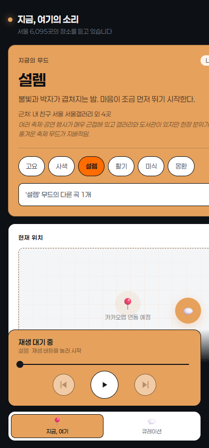
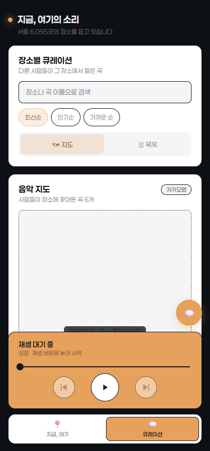

# LocalHub, 지금, 여기의 소리

> 서울 지역 위치 기반 무드 플레이어 + 익명 커뮤니티 + 지역 정보 챗봇 — 지금 있는 장소의 분위기에 맞는 음악을 듣고, 그 장소에 어울리는 곡을 남기고 싶은 사람을 위한 서비스입니다.

내 주변 장소가 만드는 무드로 플레이리스트를 고르는 **위치 기반 앰비언트 플레이어**. 한국관광공사 TourAPI 4.0 서울 데이터(8,150건)를 브라우저에서 직접 불러와, 현재 위치 주변 장소의 성격으로부터 무드를 정하고 그 무드에 맞는 음악을 크로스페이드로 이어 재생합니다. 백엔드 서버 없이 Vue 3 + Vite만으로 동작하는 정적 SPA입니다.


## 데모

**배포 URL**: [LocalHub, 지금, 여기의 소리](https://projectvive.netlify.app/)

| 홈 — 무드·위치 | 큐레이션 — 지도/목록 |
|---|---|
|  |  |

## 기술 스택

| 구분 | 내용 |
|------|------|
| 프레임워크 | Vue 3 (`<script setup>` SFC) + vue-router 5 |
| 빌드 | Vite 8 (`@vitejs/plugin-vue`) |
| 지도 | Kakao Maps JavaScript SDK (`src/lib/kakao.js`, `src/components/CurationMap.vue`) |
| 챗봇 | OpenAI API 브라우저 직접 호출 (`src/lib/chat.js`, `src/components/ChatbotLauncher.vue`) |
| 데이터 | `public/data/*.json` — TourAPI 서울 원본을 런타임 fetch (번들 미포함, 원본 무수정) |
| 오디오 | Web Audio 기반 크로스페이드 (cloudflare 소스) |
| 배포 | Netlify (SPA 리다이렉트 포함) |
| 백엔드 | 없음 — 커뮤니티는 localStorage, 챗봇은 프론트에서 OpenAI API 직접 호출 |

## 실행 방법

```bash
npm install
npm run dev        # http://localhost:5173 — LAN에도 노출됨 (같은 와이파이의 폰에서 접속 가능)
```

```bash
npm run build      # dist/ 생성
npm run preview    # 빌드 결과 로컬 확인
```

> **위치 권한 참고**: 위치 기능은 보안 컨텍스트에서만 동작합니다. `localhost`는 허용되지만, LAN IP(HTTP)로 폰에서 접속하면 자동으로 기본 위치(서울시청)로 폴백됩니다.

### 환경변수 (.env)

키가 필요한 기능(지도, 챗봇)을 쓰려면 `.env`를 만들어야 합니다. `.env.example`을 복사해서 값만 채우세요.

```bash
cp .env.example .env
```

| 변수 | 용도 | 비고 |
|------|------|------|
| `VITE_KAKAO_KEY` | 카카오맵 JavaScript 키 | 카카오 개발자 콘솔 → 플랫폼 → Web에 `http://localhost:5173` 등록 필요 |
| `VITE_OPENAI_API_KEY` | 챗봇 OpenAI API 키 | `VITE_` 접두사 값은 빌드 결과물에 노출됨 — **사용량 제한 키만 사용**, 결제 한도를 낮게 설정 |

- 실제 키 값은 절대 커밋하지 않습니다 (`.env`는 `.gitignore` 대상).
- Netlify 배포 시에는 대시보드 → Site settings → Environment variables에 별도 등록합니다.
- 소스코드 제출 시 `.env` 파일 미포함을 반드시 확인합니다.

## 구현한 기능 (MVP 기준)

[`docs/요구사항.md`](./docs/요구사항.md) 기준 Must(필수) 항목 대비 현재 구현 상태입니다.

- [x] 제공 데이터 연동 — TourAPI 서울 8,150건을 프론트에서 직접 fetch (백엔드 서버 없음)
- [x] 활용 데이터 목록화 — `public/data/SCHEMA.md`, `public/data/SOURCE.md`
- [x] 익명 커뮤니티 — 회원가입·로그인 없음
- [x] 게시글 CRUD — 목록 / 상세 / 작성 / 수정 / 삭제 (`src/views/Curation*.vue`, `src/lib/communityStore.js`)
- [x] 비밀번호 권한 확인 — 작성 시 비밀번호 저장, 수정·삭제 시 평문 대조(`verifyPassword`) — 교육 목적으로 암호화 없이 설계
- [x] 챗봇 - OpenAI 연동 — 프론트에서 직접 호출
- [x] 챗봇 - 질의 응답 — **제공 JSON(관광지·문화시설·축제·여행코스·레포츠·쇼핑) + 커뮤니티 게시글** 기반 자연어 질의응답. 
- [x] 챗봇 - UI 컴포넌트 — 데스크톱 플로팅 패널 / 모바일 전체화면
- [x] Vue 3 SPA — 라우터 4개 화면 구성
- [x] 배포 (Netlify) — 빌드/리다이렉트 설정(`netlify.toml`) 완료

선택(Should, 최소 1개) 항목:

- [x] 지도 시각화 — Kakao Maps 기반 큐레이션 지도 (`CurationMap.vue`)

## 화면 구성

| 경로 | 화면 |
|------|------|
| `/` | 홈 — 무드 카드 · 현재 위치 · 곡 추천 유도 · 근처 장소 리스트 |
| `/community` | 장소별 큐레이션 목록 — 검색, 정렬, 지도↔목록 보기 전환 |
| `/community/new` | 곡 등록 폼 (장소·곡·아티스트·무드·한마디·비밀번호) |
| `/community/:id` | 글 상세 — 곡 정보, 좋아요, 비밀번호 기반 수정/삭제, 댓글 |

플레이어와 하단 내비게이션은 앱 셸에 고정되어 있어 **페이지를 이동해도 재생이 끊기지 않습니다.** 무드 색상은 CSS 변수로 주입되어 화면 전체 톤이 함께 바뀝니다.

## 핵심 기능 상세

1. **위치 획득** — GPS 좌표 획득, 권한 거부·타임아웃·HTTP 접속 시 서울시청 폴백 + 사유 표시
2. **근접 장소 탐색** — 하버사인 거리로 가까운 순 상위 5곳, 반경 3km에서 시작해 8→20→50km 단계 확장
3. **무드 시스템** — 6개 무드(고요·사색·활력·축제·미식·도심 산책)가 TourAPI 콘텐츠 유형과 매핑, 선택 시 화면 톤·플레이리스트 즉시 전환
4. **크로스페이드 플레이어** — 두 덱(A/B) 오버랩 방식으로 90초마다 6초 페이드 전환, 첫 재생은 자동재생 정책상 사용자 제스처로 언락
5. **오디오 소스 토글** — 생성 앰비언트(무드별 사운드 레시피) ↔ 유튜브(무드별 영상 ID) 전환
6. **커뮤니티** — 회원가입 없는 익명 방식, 작성 시 비밀번호 저장 후 수정·삭제 시 대조 (localStorage)
7. **챗봇** — 데스크톱 플로팅 패널 / 모바일 전체화면, 제공 JSON 기반 자연어 질의응답 (OpenAI)


## 사용 흐름

1. 접속 시 위치 권한 요청 → 허용하면 GPS, 거부하면 서울시청 폴백 (사유가 위치 카드에 표시)
2. 근처 장소 상위 5곳이 카테고리 배지·거리와 함께 표시
3. "지금의 무드" 카드에서 무드 선택 → 화면 톤과 플레이리스트 전환
4. 하단 플레이어 ▶로 재생 시작 → 90초마다 자동 크로스페이드, ⏭로 즉시 전환
5. 플레이어 바 탭 → 시트에서 볼륨·소스(앰비언트/유튜브) 조절
6. '큐레이션' 탭에서 장소별 곡을 지도/목록으로 탐색, "＋ 이 장소의 곡 등록하기"로 작성

## 설정 지점

| 위치 | 항목 |
|------|------|
| `src/config/settings.js` | 근접 장소 수(5), 탐색 반경 단계, 전환 주기(90초), 페이드 길이(6초), 폴백 위치 |
| `src/config/moods.js` | 무드 정의 전체 — 색·설명·트랙 레시피·유튜브 ID |
| `src/config/dataset.js` | 권역(`REGION`), 데이터 파일 목록(`FILES`), 출처 표기(`ATTRIBUTION`) |

**권역 교체**: ① 새 권역 JSON을 `public/data/`로 복사 ② `dataset.js`의 `FILES`·`REGION`·`ATTRIBUTION` 교체 ③ 끝 — 나머지 코드는 수정 불필요.

## 데이터 및 라이선스

이 서비스는 한국관광공사 Tour API(TourAPI 4.0)의 데이터를 활용하였습니다.

| 항목 | 내용 |
|------|------|
| 출처 | [한국관광공사](https://www.data.go.kr/data/15101578/openapi.do) — 서울(SEL) 8,150건, 2026-06 수집 |
| 라이선스 | [공공누리 제3유형](https://www.kogl.or.kr/info/licenseTypeView.do?licenseType=3) (출처 표시 + 변경 금지) |
| 준수 사항 | 원본 JSON 무수정 (한글 파일명만 CDN 인코딩 회피를 위해 ASCII로 변경, 내용은 바이트 동일), 출처 표기를 앱 푸터에 상시 노출 |

스키마·파일별 건수는 `public/data/SCHEMA.md`, `public/data/SOURCE.md` 참조.

## 배포 (Netlify)

`netlify.toml`에 빌드 명령(Node 22)과 SPA 리다이렉트(`/* → /index.html`)가 설정되어 있습니다. 환경변수(`VITE_KAKAO_KEY`, `VITE_OPENAI_API_KEY`)는 Netlify 대시보드에 별도 등록해야 합니다.

## 프로젝트 구조

```
project_vive/
├─ index.html                  # 앱 진입 HTML
├─ vite.config.js              # host: true (LAN 노출)
├─ netlify.toml                # Netlify 빌드/리다이렉트
├─ public/
│  └─ data/                    # TourAPI 서울 JSON 6종 + SCHEMA.md + SOURCE.md
└─ src/
   ├─ main.js / App.vue        # 앱 셸 — 위치→장소→무드→플레이어 파이프라인 소유
   ├─ router/index.js          # 4개 라우트
   ├─ config/                  # settings · moods · dataset · contentTypes
   ├─ composables/             # useGeolocation · useNearbyPlaces · useMoodPlaceholder · useCrossfadePlayer
   ├─ lib/                     # geo(하버사인) · pois(로더) · engines(오디오 엔진) · kakao · chat · communityStore
   ├─ components/              # PlayerBar · NowPlayingSheet · MoodCard · CurationMap · ChatbotLauncher 등
   └─ views/                   # Home · Community · CurationNew · CurationDetail
```

## 팀 구성 / 역할

담당 항목은 커밋 이력 기준으로 확인 가능한 범위만 정리했습니다.

| 이름 | git 계정 | 담당 |
|------|----------|------|
| 임상준 | `imsangjun` | 프론트엔드 UI/디자인 — 폰트, 카드 디자인, 색감, 호버·터치 인터랙션, 초기 프론트엔드 스캐폴딩 |
| 이재원 | `jaewon` | 카카오맵 초기 프로토타입 구현 (지도 연동 담당), 배포 준비 및 배포  |
| 우지현 | `jihyun-el` / `manu` / `5t5tws5c79-ship-it` (여러 기기·계정 사용) | 챗봇(OpenAI) 연동, 무드 플레이어(오디오 크로스페이드) 개발 및 통합, 카카오맵 앱 통합, 커뮤니티 게시판 CRUD 및 비밀번호 기반 수정·삭제|

## 협업 방식 / 그라운드 룰

- **소통 채널**: Mattermost
- **브랜치 전략**: `feat/`, `fix/`, `integration/` 등 목적별 prefix 브랜치에서 작업 → `master`는 가급적 PR 승인 후 merge로 반영(보호 브랜치, 직접 push 자제)
- **커밋 컨벤션**: `feat:`, `fix:`, `chore:`, `docs:`, `ui:` 등 타입 프리픽스 + 한글 설명

## 트러블슈팅

- **무드 추천이 특정 무드로 쏠림**: LLM 기반 무드 추론이 반복 호출 시 특정 무드로 편향되는 문제가 있어, 프롬프트를 정비·압축하고 직전 무드를 enum에서 제외하여 입력하여 무드가 고르게 나오도록 수정했습니다.
- **오디오 크로스페이드 동작 불일치**: `mood_player/` 프로토타입에서 검증된 페이드인/아웃·다음 곡 재생 로직을, Vue 앱에 통합하는 과정에서 동일하게 재현되지 않는 문제가 있어 프로토타입 동작을 기준으로 재정렬했습니다.

## 회고

커뮤니티 컨셉을 텍스트 게시판이 아닌 "장소별 곡 큐레이션"으로 좁힌 것은 착수 전 강사님(의뢰사)과 협의한 방향이었고, 필수 요구사항(CRUD·비밀번호 대조·익명성)은 그 안에서 전부 충족했습니다. 다만 메인 기능(플레이어, 챗봇) 구현에 집중하는 동안 이 컨셉이 와이어프레임 예시([참고 4])의 일반적인 "정보 공유" 형태와 얼마나 벌어졌는지를 중간에 자주 점검하지 못했습니다. 협의된 방향이더라도 진행 중간중간 원 요구사항 대비 스코프를 문서와 실제 동작 양쪽으로 확인하는 습관이 필요하다는 것을 배웠습니다.

기능 검증 측면에서도, 챗봇이 제공 JSON을 컨텍스트로 제대로 참조하는지를 뒤늦게 점검해 데이터 기반 응답을 확실히 하도록 보강했습니다. "문서상 구현됨"과 "실제로 의도대로 동작함"을 분리해 검증하는 것의 중요성을 확인한 지점입니다.